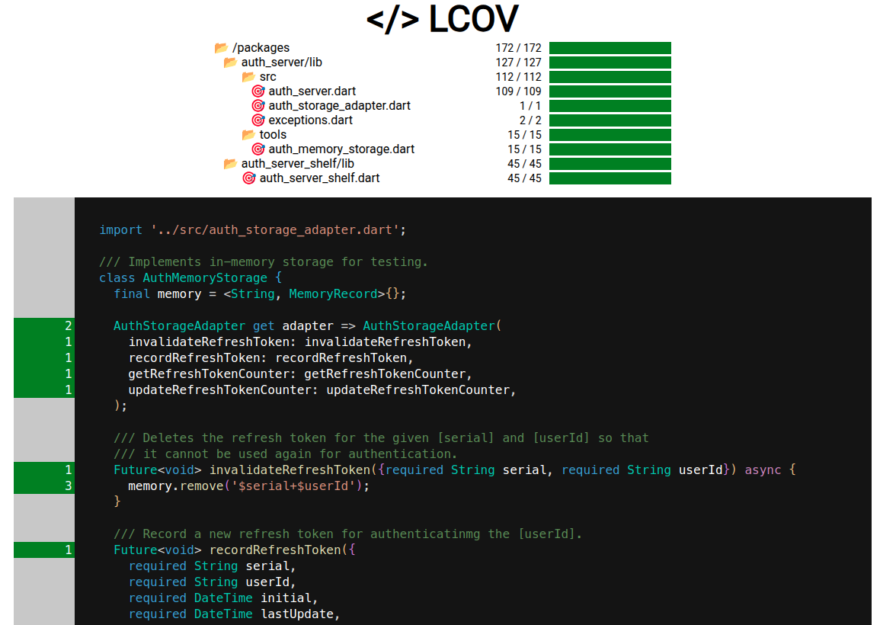
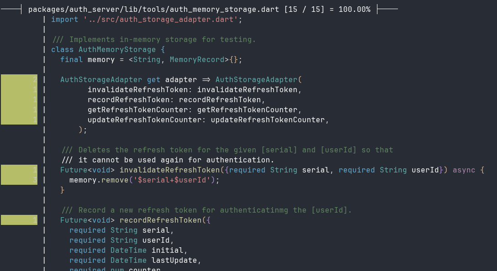

# lcov_format

An experiment to parse and render coverage information in pure dart.

```shell
flutter test --coverage your_test_folder
lcov_format -l path\to\your\coverage\lcov.info -f html -o out
```



